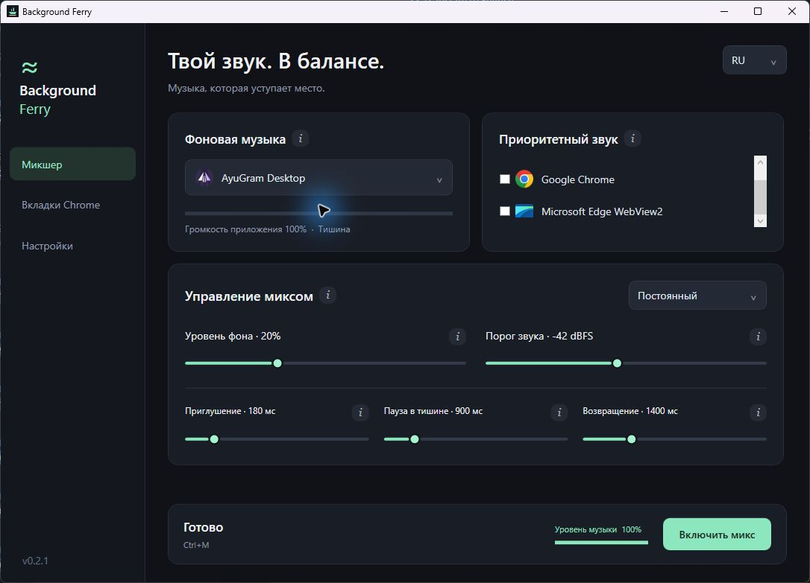

# Background Ferry

**Your music. Always in the background.**

A small Windows tray app that gently lowers your music while selected applications make sound, then brings it back during pauses. No accounts, Spotify API, virtual audio driver, administrator privileges, or runtime NuGet dependencies.

[Русский](README.ru.md) · [Architecture](docs/architecture.md) · [Contributing](CONTRIBUTING.md) · [Publish to GitHub](docs/github-publishing.md)

**New in 0.2.1:** automatic application icons and readable names, site icons for selected Chrome tabs, graphite/mint UI, persistent RU/EN, information tooltips, and an experimental [Chrome tab companion](docs/chrome-tabs.md). [Design concept](docs/design/README.md) · [Release notes](docs/release-0.2.1.md).



## Quick start

1. Extract the **entire** `BackgroundFerry-win-x64.zip` release into a permanent folder. Run `BackgroundFerry.exe`. The portable package includes .NET; installation is unnecessary.
2. Play music in a desktop player, then choose it under **Background music**.
3. Play something in another app, such as a YouTube video in Chrome. Check that app under **Priority audio**.
4. Press **Start mixing**. Close the window to keep it running in the tray.

To stop, press **Stop mixing** or choose **Exit and restore volume** in the tray menu. `Ctrl+M` toggles mixing while the window is focused.

Apps appear after they create an audio session. Their names and icons are read from installed executables, including unfamiliar players; unavailable metadata falls back to a generic audio icon and the process name. Hover a source to see its executable name. Packaged or helper processes may expose generic metadata. Saved choices remain available while the app is closed. Use separate apps in the desktop mixer. For individual tabs in Chrome, install the included companion from the Chrome tabs page.

## Two listening modes

| Mode | Behavior |
| --- | --- |
| **Steady** (default) | Consistent quiet music during priority audio. Recommended for speech and tutorials. |
| **Adaptive** | Varies background gain within a restricted quiet range based on the priority signal. Quiet speech still gets space. |

**Music remaining** is relative to the original Windows app volume, not an absolute mixer position. With music originally at 50% and remaining set to 20%, the ducked app volume is 10%. When silence lasts long enough, it returns to 50%. Background Ferry never raises it above that starting level.

Adaptive mode ranges from the selected percentage to 1.65 times that value (capped at 65% of baseline). It does not try to make two sources add up to an arbitrary “100 loudness units.”

Adjust **signal threshold** if quiet videos do not trigger mixing. The default is −42 dBFS. In **Mixing control**, tune fade down (180 ms), silence hold (900 ms), and fade back (1400 ms). Timing denotes approximately 95% of a transition. Mix parameter changes stop the desktop mix and restore music; press Start to apply them. Language and startup preferences do not stop it. Hover over an **i**, or focus it with Tab, for explanations.

## Respecting your controls

- Only the chosen music process is changed. Priority apps and master device volume are left alone.
- A manual Windows mixer volume change releases that music session until you stop/start mixing. Your change is kept.
- Mute is never changed. A muted priority session does not trigger ducking.
- Multiple sessions of the music process are handled independently, using their own starting volume.
- All active playback endpoints are scanned, with new sessions discovered about once a second.
- A write-ahead recovery journal and a small watchdog attempt to restore still-existing sessions if the app crashes. The next launch also attempts recovery.
- Optional **Start with Windows** opens the app in the tray with mixing **off**. Place the portable folder somewhere permanent before enabling it.

## Scope and limitations

Windows 10/11, shared-mode audio. The main release is x64. The publish script also accepts `win-arm64`, but that package needs separate device testing.

This is an app-volume controller, not a music player, voice recognizer, compressor inserted into an audio stream, or LUFS normalizer. It reads Windows peak meters without recording or saving audio. It cannot distinguish a word from a notification in the same chosen application. Smooth fades and a silence hold reduce pumping but are not speech detection.

- Individual Chrome tabs use the experimental companion, independently of the desktop engine. Real tab capture needs a manual listening check; see [setup and limitations](docs/chrome-tabs.md).
- Exclusive-mode playback, ASIO, and remote Spotify Connect targets are outside scope.
- Apps that change their own session volume can trigger manual override. A player's internal volume slider may operate before the Windows mixer and therefore may not be visible as an override.
- Recovery is best effort: it cannot guarantee restoration after power loss, a missing output device, or replacement of the original session. If needed, reset that app in the Windows volume mixer.
- No per-service compatibility certification is claimed. Any normal shared-mode player with its own controllable session is a candidate, including desktop streaming services and local players.

## Build from source

Install the [.NET 10 SDK for Windows](https://dotnet.microsoft.com/download/dotnet/10.0). No third-party packages are needed for compilation.

```powershell
dotnet build BackgroundFerry.slnx -c Release
dotnet run --project src/BackgroundFerry.App -c Release
```

Create a self-contained portable ZIP (the first publish downloads Microsoft's runtime packs):

```powershell
./scripts/publish.ps1
```

Output: `artifacts/BackgroundFerry-win-x64.zip`. Keep the executable and its companion files together.

## Tests

```powershell
./scripts/test.ps1
./scripts/test.ps1 -Integration
./scripts/test.ps1 -Chrome # Node.js 22+ for extension logic tests
```

The first command builds all projects and runs the deterministic assertion suite. It exits nonzero on any failure. The second also runs real Windows audio tests and **plays two very quiet synthetic tones** on the default output. It changes only its test-owned audio sessions. An active audio output and an interactive Windows session are required. Integration tests are not run on headless GitHub runners.

Coverage includes hold/release, adaptive bounds, invalid input, baseline multiplication, manual override, real session duck/restore, source exit, and watchdog crash recovery. See [validation](docs/validation.md) for the locally verified scope.

## Local data and removal

Settings, a recovery journal and bounded error logs live in `%LOCALAPPDATA%\BackgroundFerry`. No network requests or telemetry are performed by the app. Optional startup uses only `HKCU\Software\Microsoft\Windows\CurrentVersion\Run\BackgroundFerry`.

To remove: uncheck **Start with Windows**, exit from the tray, then delete the portable folder. You may also remove the local settings folder. A stale startup entry can be disabled in Windows Startup Apps.

## GitHub

CI builds, tests, and uploads the portable artifact. Pushing a `v*` tag runs tests, packages the app, and creates a GitHub Release with a ZIP and SHA-256 checksum. Portable releases are unsigned. The local project contains no hosting account details or credentials.

This project uses the MIT license. Audio ducking is an established technique; the aim here is a simple, predictable listening experience.
